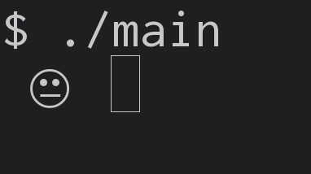

Le but de ces exercices est de vous familiariser avec les interruptions de
programme.


## yet another guessing game

Vous puvez reprendre le code que vous avez écrit pour l'exercice
[guessing-game](../01-guessing-game/README.md).

Vous ajouterez une première interruption pour huer le joueur lorsqu'il abandonne
la partie en efefctuant un `CTRL-C`.

Puis, vous ajouterez une seconde interruption pour donner un temps limité au
joueur. Une fois `X` secondes écoulées le joueur a perdu.

_Indication :_ la fonction `exit` de la bibliothèque `stdlib.h` permet de mettre
fin au programme avec le code de sortie passé en paramètre.


## mini Tamagotchi



Le but de cet excercice est de vous faire programmer un Tamagotchi simplifié.
Le terminal affiche un tamagotchi animé.
Au bout d'un certain temps le tamagotchi s'endort.
L'utilisateur peut alors efefctuer un `CTRL-C` pour réveiller le tamagotchi.

Le tamagotchi passe ainsi successivement d'un état éveillé à un état endormi.
`CTRL-C` devrait réveiller le tamagotchi lorsqu'il est endormi, et devrait
arrêter le programme lorsque le tamagotchi est éveillé.

_Indication :_ `signal(SIGINT, NULL)` permet de réinitialiser le signal `SIGINT`
avec son action par défaut (interrompre l'exécution du programme).

### Animation du tamagotchi

Le tamagotchi peut être reprséenté par de simples smeilleys :

```
😐 😉 😏 😀 😴
```

Pour animer le tamagotchi vous pouvez afficher un premier smilley puis endormir
le processus à l'aide de la fonction `sleep` de la bibliothèque `unistd.h`, et
alors afficher un second smilley.

```c
printf("\r %s ", "😐");
fflush(stdout);
sleep(2); /* in seconds */
printf("\r %s ", "😀");
fflush(stdout);
```

Le caractère de contrôle `\r' permet de rafraîchir la ligne courante du
terminal. Veillez à ne pas mettre de retour à la ligne.

L'appel à la fonction `fflush(stdout)` permet de forcer l'impression sur le
terminal.

### Pause

Lorsque le tamagotchi est endormi il doit attendre d'être réveillé.
Le programme peut être mis en pause à l'aide de la fonction `pause` de la
bibliothèque `unistd.h`.

### Pour aller plus loin

Vous puvez colorer le tamagotchi à l'aide de [séquences d'échappements
ANSI](https://en.wikipedia.org/wiki/ANSI_escape_code#Colors).

Par exemple le code suivant permet de colorer le texte en rouge :

```c
printf("\x1b[31m tex \x1b[0m");
```

`\x1b[31m` marque le début de la coloration en rouge.
`\x1b[0m` marque la fin de la coloration.


